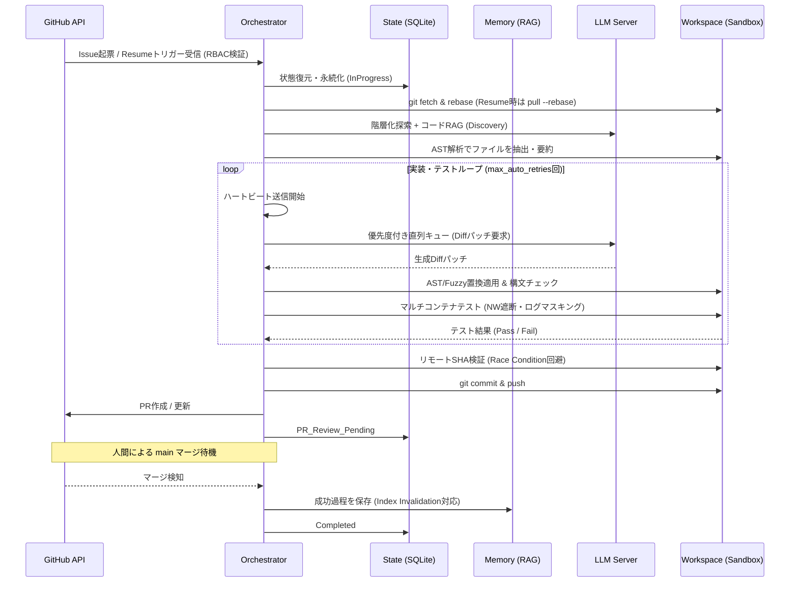

# 自律AIエージェント「Brownie」システム設計書

## 1. システム概要
Brownieは、GitHubをハブとしたローカル完結型の自律AIソフトウェアエンジニアリング環境である。
人間とAIはGitHub Issue/PR上で自然言語を用いて協働し、AIは要件定義から実装、テスト、PR作成、レビュー対応、Wiki更新までの全ライフサイクルを自動完結させる。
「疎結合アーキテクチャ」「リポジトリ単位の並列処理」「4層サンドボックス保護」「自己修復ループ」「完全自律デーモン」を備え、操作は専用コマンド `brwn` で一元管理される。

---

## 2. 動作環境と技術スタック
### 2.1. ハードウェア要件
* **推奨:** MacBook Pro M1/M2/M3 (32GB Unified Memory 以上)。
* **Linux:** GMKtec EVO-X2 等の広帯域メモリ搭載機 (VRAM/RAMの共有効率を重視)。
* **ストレージ:** 50GB以上の空き容量 (LLMモデル、Dockerイメージ、Vector DB用)。

### 2.2. ソフトウェアスタック
* **推論エンジン:** Ollama / vLLM (OpenAI互換API)。`OLLAMA_KEEP_ALIVE=-1` による常駐、APIウォームアップ必須。
* **記憶エンジン:** ChromaDB (Server Mode) / Qdrant。
* **オーケストレーター:** Python 3.10+ (uv / venv 仮想環境管理)。
* **主要ツール:** gh CLI (GitHub操作), **git-lfs (必須)**, Repomix (スキャナ), Docker / Docker Compose (隔離実行), SQLite 3.24+ (WALモード)。
* **主要ライブラリ:** PyGithub, LangChain, tree-sitter, python-Levenshtein, **transformers (HuggingFace: モデル固有トークナイズ用)**。

---

## 3. システム・アーキテクチャとディレクトリ構成

### 3.1. フル疎結合アーキテクチャ (API-Driven)
推論（脳）と記憶（海馬）を独立したAPIサーバーとして扱い、オーケストレーターをステータレスに保持。ホストの再起動後もDBの状態から即座に復帰可能。

### 3.2. ディレクトリ・モジュール構成

```plaintext
brownie/
├── bin/
│   ├── brwn                  # CLIエントリポイント（PIDロックによる二重起動防止）
│   └── setup.sh              # 統合プロビジョニングスクリプト（LFS・隔離環境・保守設定）
├── src/
│   ├── main.py               # メインプロセス（生存信号送信・LLM死活監視・要件監視・APIタイムアウト制御）
│   ├── watchdog.py           # プロセス監視・ロールバック・CrashLoopBackOff・OOM/Disk監視・LLM再起動
│   ├── core/
│   │   ├── orchestrator.py   # メインループ (RBAC・要件追従・エラー分類・退避優先クリーンアップ)
│   │   ├── worker_pool.py    # I/O並列・優先度付き推論直列キュー管理 (VRAM保護・UX通知)
│   │   └── state.py          # 状態管理 (SQLite WAL・整合性チェック・Stale Lock復旧)
│   ├── github/
│   │   ├── client.py         # PyGithub ラッパー (ETag監視・diff_hunk追従・updated_at監視)
│   │   └── filter.py         # トークナイザー動的選択・厳密なTokenizerベースTruncation
│   ├── workspace/
│   │   ├── sandbox.py        # Docker/Compose・DNS Proxy・権限マウント・GC・ログマスキング・YAMLサニタイザ
│   │   ├── repomix_runner.py # 階層化探索 (Discovery) ＋ コードRAG (Hybrid)
│   │   └── git_ops.py        # LFS同期・Fuzzy/AST置換・SHA検証・Resume時のPull-Rebase同期
│   └── memory/
│       └── vector_db.py      # 記憶保存・Index Invalidation (デッドリンクGC)
└── config/
    └── config.yaml           # システム共通設定 (OOB通知・優先度・タイムアウト等)
```

---

## 4. コア・コンポーネント設計 (主要クラス)

* **Orchestrator (司令塔):**
    * **LLM監視:** `/health` を定期チェック。API無応答時はWatchdogへ再起動指示。長時間生成（15分〜）に対応した**無限タイムアウト**を設定。
    * **要件追従:** GitHubの `updated_at` を監視。人間による要件（Description）の変更に即座に追従しコンテキストを更新。
    * **RBAC (権限検知):** 指示はリポジトリの Collaborator または Owner 権限を持つ人間からのもののみを実行。
    * **退避優先:** 権限剥奪時、GitHubへの報告より**ローカルの状態クリーンアップとワークスペース退避を最優先**で完遂。
    * **ハートビート:** 重い推論中、Watchdogへ「生存信号」を送信し、誤再起動を防止。
* **StateManager (状態管理):** 起動時に整合性チェックを実行。OSクラッシュ等による **Stale Lock（`.shm` / `.wal` 不正残存）を自動検知し復旧**。
* **GitHubClient & IssueFilter:** ETagを用いた高頻度監視（Webhookは使用しない）。**`[bot]` アカウントは無視。** `diff_hunk` を取得し、行ズレ（Desync）をFuzzy/ASTで自動補正。
* **WorkspaceManager (サンドボックス):** **YAMLサニタイザー**で `privileged`, `volumes` マウント等の攻撃をブロック。`--user $(id -u):$(id -g)` 指定によりホスト側の権限ロックを回避。**Git LFS**の整合性を確保。
* **MemoryManager (2層RAG):** 人間がPRをマージした瞬間に成功体験を保存。ファイル移動・削除時にDB内の無効な記憶を消去（Index Invalidation）。

---

## 5. アカウント管理とデータ・設定スキーマ

### 5.1. 外部設定管理 (config.yaml)
```yaml
agent:
  mention_name: "@brownie-agent"
  polling_interval_sec: 15
  oob_webhook_url: "https://hooks.slack.com/..." # トークン失効・LLM停止等のFatalエラー用
  queue_ux_notification: true # 順番待ち時にGitHubへ推定時間をコメント
  inference_priority: # タスク優先度 (1=高)
    manual_issue: 1
    review_comment: 2
    auto_wiki: 3
llm:
  endpoint: "http://localhost:11434/v1"
  timeout_sec: 0 # 無限タイムアウト
  tokenizer: "auto" # transformersによりモデル構成を動的ロード
```

### 5.2. Vector DB スキーマ
過去の記憶が最新コードに対してハルシネーションを起こすのを防ぐため、`repo_name`, `issue_id`, `scope`, `type`, `commit_hash`, `last_modified`, `timestamp` の各フィールドにより陳腐化とデッドリンクを管理。

---

## 6. コミュニケーションとAIの振る舞い設計
* **Resume:** `@brownie-agent resume` 受信時は、人間が解決した最新状態を取り込むため、必ず **`git pull --rebase origin <branch>`** を実行してから再開。
* **編集方式:** トークン保護のため「Diffパッチ/Search-Replace方式」に限定し、AST構文チェックを実施。
* **Queue UX:** 推論待ち発生時は「現在順番待ちです。推定開始時刻：約XX分後」と自動投稿し、沈黙による不信感を防ぐ。

---

## 7. ワークフローと高度な制御シーケンス

### 7.1. 自動化パイプライン
1.  **監視:** ETag/updated_atによる高頻度ポーリング。
2.  **探索:** 階層化探索 ＋ コードベースRAG。**モデル崩壊防止のため `/docs` や Wiki は探索除外。**
3.  **推論:** **優先度付き直列キュー** ＋ **Tokenizerベースの厳密なトークンカウントTruncation** (Sliding Window方式)。
4.  **テスト:** ネットワーク分離環境（DNS Proxy） ＋ **ログスクラビング**（機密情報を `***` に置換）。
5.  **競合回避:** Push直前にリモートSHAを再検証し Race Condition を回避。

### 7.2. タスク処理シーケンス


---

## 8. サンドボックス＆実行環境 (4層防御)
1.  **隔離:** Docker/Compose (マルチコンテナ対応)。
2.  **NW制御:** フェーズ別通信制御 (依存解決はDNSホワイトリスト、テスト時はNW完全遮断)。
3.  **保護:** サニタイザーによる特権マウント禁止。
4.  **浄化:** タスクIDラベルによるオーファンコンテナ・ボリュームの定期GC。

---

## 9. 記憶・エラー処理・自己修復
* **自己修復メタ・ループ:** `SystemInternalError` 時に発動。旧安定版へロールバック。
* **自己承認ロック:** 自己修復PRはAIによる自動マージを禁止。**必ず人間の手動承認を必須**とする。
* **CrashLoopBackOff:** 連続クラッシュ時はOOB (Out-of-Band) 通知を行いプロセスを停止。

---

## 10. 運用監視とインフラ保護
* **OOM/Diskサーキットブレーカー:** メモリおよび**ディスク残量**を常時監視。枯渇前にコンテナ一時停止。
* **死活監視:** ハートビート（Orchestrator）と `/health`（LLM Server）を監視。
* **リソース優先度:** LLMサーバーに `nice` 値を設定し、監視プロセス用のリソースを確保。
* **ストレージ保守:** `logrotate`, `git gc --prune=now`, SQLite `VACUUM` を定期実行。

---

## 11. 環境セットアップとプロビジョニング (setup.sh)

### 11.1. 事前チェック
* **OS:** macOS 13+ または Linux (Ubuntu 22.04 LTS 推奨)。
* **メモリ:** 物理RAM 32GB以上が必須。

### 11.2. ツール導入
* `git`, `git-lfs`, `gh` の導入と `git lfs install` の実行。
* `docker`, `docker-compose-plugin` の導入。
* `ollama` インストールと推奨モデルの事前プル。

### 11.3. 隔離環境と権限設定
* `uv` または `venv` による Python 仮想環境の構築。Brownie本体を隔離。
* **非Root実行:** systemd (Linux) または launchd (Mac) への登録を **非Root実行ユーザー権限** で行い、DBファイルへのパーミッション競合を排除。

### 11.4. 保守・保護設定
* **Nice値の設定:** LLMプロセスに対して `nice -n 10` を適用。
* **ディレクトリ初期化:** `~/.local/share/brownie/` およびキャッシュディレクトリの構築。
* **Logrotate:** 週次ローテーションと圧縮の自動設定。
