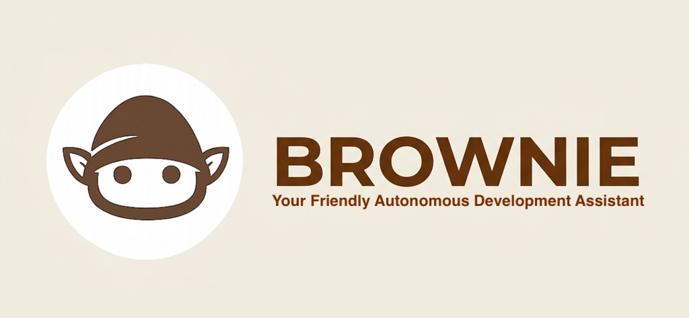

<div align="center">
 


# 🍪 BROWNIE
### Your Friendly Autonomous Development Assistant

[]()
[]()
[]()
[]()

**BROWNIE** は、AI エージェントが自律的にソフトウェア開発の全工程（調査・設計・実装・検証・PR作成）を完結させるために最適化された、次世代のエンジニアリング基盤です。

[Explore the Docs »](docs/Home.md)
/
[View Blueprints »](#-blueprints)
/
[Quick Start »](#-getting-started)

</div>

---

## 🌟 Why BROWNIE?

従来の開発環境は「人間」のために設計されてきました。しかし、AI エージェントが自律的に働くためには、より「構造的」で「堅牢」な基盤が必要です。BROWNIE は、AI が「迷わず、安全に、確実な成果を出すこと」に特化した **Agent-Friendly Architecture** を提供します。

| 🏎️ **High Locality** | 🎯 **Explicit Tools** | 🛡️ **Robust Infra** | 🧠 **Meta-Cognition** |
| :--- | :--- | :--- | :--- |
| パス解決とセキュリティ境界を一元化し、AI の推論ノイズを排除。 | Pydantic AI による厳格な型定義でツールの誤用を構造的に防止。 | 独立した MCP サーバーと Docker 隔離による鉄壁のプロセス管理。 | 実行状態を客観視し、エラーを自律的に修復する Self-Healing ループ。 |

---

## 🧠 Multi-Agent（マルチエージェント）アーキテクチャ

BROWNIE は、役割を分担させた複数の AI モデルを連携させる「Multi-Agent アーキテクチャ」を採用しています。これにより、単一の軽量モデルが抱えていた「Function Calling の不安定さ」と「コーディング能力の不足」というトレードオフを、構造的に解決しました。

---

## 🏗️ Architecture Layers

BROWNIE は 3 つの分離されたプレーンで構成され、高い信頼性と拡張性を実現しています。

### 🧠 Control Plane
**The Brain.** LangGraph によるワークフロー制御と、Planner-Executor パターンによる高度な意思決定を行います。
- `Orchestrator` / `Agent` / `Workflow`

### 💾 Perception Plane
**The Eyes.** DuckDB による AST 解析と NetworkX による依存関係分析により、コードベースの「空間的」把握を支援します。
- `Knowledge MCP Server` / `Code Analyzer`

### 🛠️ Execution Plane
**The Hands.** Docker 隔離環境（Sandbox）内での副作用実行と、厳格な検証を担います。
- `Workspace MCP Server` / `Sandbox Manager`

---

## 💻 Tech Stack

BROWNIE は、最高峰の OSS ライブラリを組み合わせて構築されています。

| Layer | Technologies |
| :--- | :--- |
| **Logic & State** |     |
| **Connectivity** |    |
| **Intelligence** |    |
| **Analysis** |    |

---

## 📚 Blueprints

BROWNIE は、AI 自身がシステムを理解・再構築できるレベルの「厳格な設計書」として存在します。

| Category | Components |
| :--- | :--- |
| **Core** | [Orchestrator](docs/src_core_orchestrator.md) • [Agent](docs/src_core_agent.md) • [Workflow](docs/src_core_workflow.md) |
| **Workspace** | [Context](docs/src_workspace_context.md) • [Sandbox](docs/src_workspace_sandbox.md) • [GitOps](docs/src_workspace_git_ops.md) |
| **Analysis** | [Analyzer](docs/src_workspace_analyzer_core.md) • [FlowTracer](docs/src_workspace_analyzer_flow.md) • [Repomix](docs/src_workspace_repomix_runner.md) |
| **Infra** | [Manager](docs/src_mcp_server_manager.md) • [WorkspaceServer](docs/src_mcp_server_workspace_server.md) • [KnowledgeServer](docs/src_mcp_server_knowledge_server.md) |

---

## 🚀 Getting Started

### 📋 Prerequisites

BROWNIE のフル機能を活用するには、以下の環境とプログラムが必要です。これらの依存関係の多くは `./bin/setup.sh` によって自動的にインストール・設定され、`./bin/unsetup.sh` によってシステムから安全にクリーンアップされます。

- **Hardware & OS**:
    - **Apple Silicon (M1/M2/M3)**: 高速なローカル推論 (MLX) のための推奨環境。
    - **macOS / Linux**: 推奨ランタイム環境。
- **Language Runtimes & Managers**:
    - **Python 3.11+**: メインランタイム。
    - **[uv](https://github.com/astral-sh/uv)**: 高速なパッケージ・プロジェクト管理に使用。
    - **Node.js / npm**: JavaScript/TypeScript の静的解析 (`ESLint`, `Prettier`) に必要。
- **LLM Models & Providers**:
    - **Local**: `Llama 3.1 8B` (Planner), `Qwen 2.5 Coder 7B` (Executor).
    - **Cloud**: `Google Gemini` (デフォルトのバリデーションエンジン), OpenAI, Anthropic 等。
    - *※ [LiteLLM](https://github.com/BerriAI/litellm) によるマルチプロバイダー対応。*
- **Essential CLI Tools**:
    - **Docker & Docker Compose**: 隔離環境（サンドボックス）でのタスク実行。
    - **Git & Git LFS**: リポジトリ操作と大容量データ管理。
    - **Repomix**: コードベース全体のコンテキスト圧縮。
    - **Analysis & Linting**: `Semgrep`, `ast-grep (sg)`, `Ruff`, `Black`, `Bandit`.
- **Core Technologies**:
    - **Orchestration**: `Pydantic AI`, `LangGraph` (状態管理), `Huey` (非同期ワークフロー).
    - **Perception Engine**: `DuckDB` (AST解析), `NetworkX` (依存グラフ分析), `ChromaDB` (ベクトル検索).
    - **Safe Extraction**: `Instructor` (型安全な LLM 出力抽出).
    - **Parsing & Grammar**: `Tree-sitter` (多言語解析), `Outlines` / `XGrammar` (構造化出力制御).
    - **Connectivity**: `FastMCP` (MCPサーバー), `PyGithub` (GitHub API), `AnyIO` (非同期 I/O).

### 🔧 Installation
```bash
# クローンとセットアップ
git clone https://github.com/globalpocket/brownie.git
cd brownie
./bin/setup.sh
```

### 🏃 Running
```bash
# Orchestrator と Worker の起動
./bin/brwn start
```

---

## 🔬 Technical Deep Dive

### 🗄️ AIモデルの管理：HuggingFaceの「デフォルトの罠」とBrownieの対策

Brownieはローカル環境で強力なAIを稼働させるため、数十GBに及ぶ巨大なLLM（大規模モデル）をダウンロードします。このモデルファイルの管理において、BrownieはHuggingFaceのデフォルト挙動が抱えるリスクを回避する独自の安全設計を採用しています。

#### 🚨 HuggingFaceの「デフォルトの罠」
通常、HuggingFaceのライブラリは「インストール不要ですぐにモデルを試せる」ことを優先し、モデルをOS標準の一時保管場所（`~/.cache/huggingface/hub/`）に保存します。
しかし、15GBを超えるような「再ダウンロードに膨大な時間とネットワークリソースを要するデータ」を、OSの都合で消去されうる「一時キャッシュ」として扱うことは、巨大なローカルLLMを運用する上で大きなリスク（設計上の脆弱性）となります。

#### 🛡️ Brownieの解決策：キャッシュから「大切な資産」へ
Brownieは、この危ういデフォルト挙動にあえて従いません。
システムとスクリプトレベルで保存先を明示的に上書きし、**Brownie専用の安全な永続データ領域**へとモデルを隔離します。

* **専用の保存場所:** `~/.local/share/brownie/models/`
* **設定のカスタマイズ:** `config/config.yaml` の `model_dir` にて、ユーザーの環境に合わせて柔軟に変更可能です。

これにより、Brownieは巨大なAIモデルを単なる「キャッシュ（一時的なゴミ）」ではなく、システムの中核を成す**「大切な資産（アセット）」**として保護します。OSのクリーンアップ等による不意の消失を防ぎ、安定したローカル開発環境を約束します。

#### 💾 ディスク容量の解放（不要な過去モデルの削除）について
Brownieは上記のようにモデルを大切に保管するため、設定（`config.yaml`）でAIモデルを別のモデルに切り替えて試行した場合でも、過去にダウンロードした古いモデルデータは自動的には削除されません。そのため、過去の試行錯誤の跡が蓄積し、ディスク容量を数十GB圧迫する場合があります。

容量を解放するには、`bin/unsetup.sh` を実行してクリーンアップを行うか、`~/.local/share/brownie/models/` 内の不要なモデルディレクトリを手動で削除してください。

### 🛡️ Secure Sandbox
すべてのコード実行と検証は、`SandboxManager` が制御する Docker コンテナ内で行われます。ホストマシンのファイルシステムやネットワークへの不用意な干渉は構造的に遮断されており、AI エージェントが自律的に `rm -rf /` を実行しても安全です。

---

<div align="center">

### 🤝 Join the Autonomous Revolution
BROWNIE は、AI が「ただの道具」ではなく「自律的なチームメンバー」として機能するための、最も信頼できる基盤を提供します。

[GitHub](https://github.com/globalpocket/brownie) / [Wiki](docs/Home.md)

</div>
