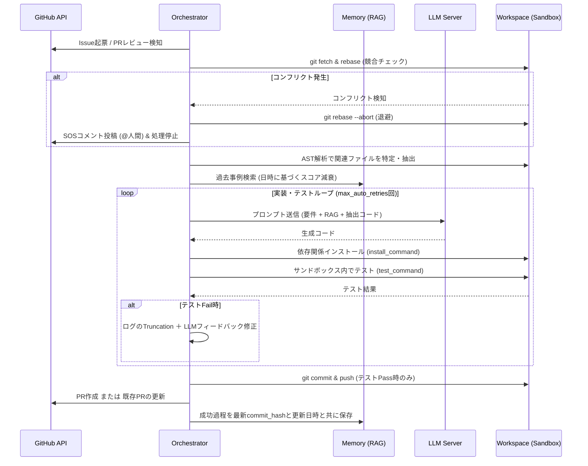

# 自律AIエージェント「Brownie」システム設計書

## 1. システム概要

BROWNIEは、GitHubをハブとしたローカル完結型の自律AIソフトウェアエンジニアリング環境である。人間とAIはGitHub IssueおよびPR（プルリクエスト）上で自然言語を用いて協働し、AIは要件定義から実装、テスト、PR作成、レビュー対応、Wiki更新までの全ライフサイクルを自動で完結させる。「疎結合アーキテクチャ」「リポジトリ単位の並列処理」「4層構造のサンドボックス保護」、旧バージョンからの「自己修復ループ」、そしてシステム再起動にも耐えうる「完全自律デーモン」として機能する。操作は専用コマンド `brwn` で一元管理される。

---

## 2. 動作環境と技術スタック

### 2.1. ハードウェア要件

* **フェーズ1:** MacBook Pro M1/M2/M3 (32GB Unified Memory 以上)。
* **フェーズ2:** GMKtec EVO-X2 等の広帯域メモリ搭載 Linux マシン。
* **ストレージ:** 50GB 以上の空き容量 (LLMモデル、Dockerイメージ、Vector DB用)。

### 2.2. ソフトウェアスタック

| カテゴリ | ツール/ライブラリ | 役割 |
| --- | --- | --- |
| **推論エンジン (LLM Server)** | Ollama または vLLM (OpenAI互換API) | モデル常駐 (`OLLAMA_KEEP_ALIVE=-1`) および起動時の API ウォームアップを必須とする。 |
| **記憶エンジン (Vector DB Server)** | ChromaDB (Server Mode) または Qdrant。|
| **オーケストレーター** | Python ＋ Watchdog | スクリプト ( 実行・司令塔・監視・回復・デーモン管理) |
| **主要ツール** | gh CLI , Repomix , Docker , systemd/launchd , **git-lfs (必須)** | GitHub操作,コードベーススキャナ,サンドボックス,デーモン化 |
| **主要ライブラリ** | PyGithub, LangChain , tree-sitter , **transformers** | 脳と記憶を抽象化,AST解析用,トークナイズ用 |
| **推奨モデル** | **Qwen3-Coder:30b** (MoE) | M1 Mac 32GB 環境で高速かつ高度な推論を実現 |

### 2.3 マシンユーザー (Machine User) 運用

* **アカウント分離:** 人間とAIのアカウントを完全に分離。
* **権限:** **Fine-grained PAT (最小権限PAT)** を使用。必要最小限の Scope に絞る。
* **無限ループ防止:** AIアカウントは「Collaboratorからの指示」にのみ反応。

---

## 3. システム・アーキテクチャとディレクトリ構成

### 3.1. フル疎結合アーキテクチャ (API-Driven)

推論（脳）と記憶（海馬）を独立したAPIサーバーとして扱い、オーケストレーターをステートレスに保持。**LangChain の採用により、記憶エンジン (DB) の差し替え時もメインロジックの修正を不要とし、高い柔軟性を確保する。**

### 3.2 コア・コンポーネント設計 (主要クラス)

* **Orchestrator (司令塔):**
  * **LLM監視:** `/health` を定期チェック。API無応答時はWatchdogへ再起動指示。長時間生成（15分〜）に対応した**無限タイムアウト**を設定。
  * **要件追従:** GitHubの `updated_at` を監視。人間による要件（Description）の変更に即座に追従しコンテキストを更新。
  * **RBAC (権限検知):** 指示はリポジトリの Collaborator または Owner 権限を持つ人間からのもののみを実行。
  * **退避優先:** 権限剥奪時、GitHubへの報告より**ローカルの状態クリーンアップとワークスペース退避を最優先**で完遂。
  * **ハートビート:** 重い推論中、Watchdogへ「生存信号」を送信し、誤再起動を防止。
* **StateManager (状態管理):** 起動時に整合性チェックを実行。OSクラッシュ等による **Stale Lock（`.shm` / `.wal` 不正残存）を自動検知し復旧**。
  * SQLite仕様: WALモード。
  * 復旧プロトコル: スタートアップ時に PRAGMA integrity_check を実行。OSクラッシュ等による Stale Lock（.shm / .wal 不正残存）を自動検知して削除。
* **GitHubClient & IssueFilter:** ETagを用いた高頻度監視（Webhookは使用しない）。**`[bot]` アカウントは無視。** `diff_hunk` を取得し、行ズレ（Desync）をFuzzy/ASTで自動補正。
  * スマート・ポーリング: Webhookを使用せず、ETag および If-Modified-Since を活用し、API制限消費を極小化。
  * ノイズ排除: [bot] アカウントからのコメントは完全に無視。
  * デシンク補正: 行ズレが発生した場合、diff_hunk を取得し、FuzzyマッチおよびAST解析により最新コードへの適用位置を自動補正。
* **WorkspaceManager (サンドボックス):** **YAMLサニタイザー**で `privileged`, `volumes` マウント等の攻撃をブロック。`--user $(id -u):$(id -g)` 指定によりホスト側の権限ロックを回避。**Git LFS**の整合性を確保。
* **MemoryManager (2層RAG):** 人間がPRをマージした瞬間に成功体験を保存。ファイル移動・削除時にDB内の無効な記憶を消去（Index Invalidation）。
* **WorkspaceSync (動的同期):**
  * **自動参加 (Auto-clone):** `GET /user/repos` を監視し、招待（Collaborator）されたリポジトリを自動検知してローカルへ `git clone`。リポジトリ追加の手間をゼロ化。
  * **自動退出 (Auto-delete):** 権限剥奪やリポジトリ削除を検知した際、ローカルの対象ディレクトリを自動的に削除（またはゴミ箱へ移動）し、ストレージをミラーリング。

### 3.3. ディレクトリ・モジュール構成

```plaintext
brownie/
├── bin/
│   ├── brwn                  # CLIエントリポイント
│   └── setup.sh              # プロビジョニング＆デーモン登録スクリプト
├── src/
│   ├── main.py               # メインプロセス
│   ├── watchdog.py           # プロセス監視・自動ロールバック・旧版起動・再起動制御
│   ├── cli/                  # CLIコマンドパーサー (start, stop, logs 等)
│   ├── core/
│   │   ├── orchestrator.py   # メインループ (Issue/PR監視、タスク制御)
│   │   ├── worker_pool.py    # リポジトリ単位の並列処理管理
│   │   └── state.py          # エージェントの状態管理 (SQLite WAL)
│   ├── github/
│   │   ├── client.py         # PyGithub ラッパー (ETag/Backoff/GraphQL対応)
│   │   └── filter.py         # ノイズフィルター・ASTチャンキング
│   ├── llm/
│   │   ├── provider.py       # OpenAI API互換インターフェース
│   │   └── prompts/          # タスク別のプロンプトテンプレート群
│   ├── workspace/
│   │   ├── sandbox.py        # Docker/Compose・DNS Proxy・権限マウント・GC・ログマスキング・YAMLサニタイザ
│   │   ├── repomix_runner.py # 階層化探索 (Discovery) ＋ コードRAG (Hybrid)
│   │   └── git_ops.py        # LFS同期・Fuzzy/AST置換・SHA検証・Resume時のPull-Rebase同期
│   └── memory/
│       └── vector_db.py      # 記憶保存・Index Invalidation (デッドリンクGC)
└── config/
    └── config.yaml           # システム共通設定 (OOB通知・優先度・タイムアウト等)
```

## 4. サンドボックス＆実行環境 (4層防御と品質保証)

* **隔離:** Docker/Compose (マルチコンテナ対応)。
* **NW制御:** 依存解決はDNSホワイトリスト、テスト時はNW完全遮断。
* **保護:** サニタイザーによる特権実行・マウント禁止。
* **浄化:** タスクIDラベルによるオーファンコンテナ・ボリュームの定期GC。
* **品質ガードレール:** `install_command` ＋ `test_command` によるコミット前検証。
* **セキュリティガードレール:**
* **Read-Only FS:** ホストのシステムファイルアクセス防御 (`--read-only --tmpfs /tmp`)。
* **Resource Quotas:** 無限ループによるホストダウン防止 (`--memory="2g" --cpus="1.0"`)。
* **Volume Isolation:** ターゲットリポジトリのディレクトリのみをマウント。
* **Secret Injection:** `inject_secrets` で許可されたキーのみを `-e` オプションで動的に注入。

### 4.1. インフラ・フェイルセーフ

* **OOM/Diskサーキットブレーカー:** 空きメモリおよびディスク残量を常時監視。枯渇前にコンテナ一時停止（Pause）または推論スロットリング。
* **リソース優先度 (Nice値):** LLMプロセスに nice 値を設定。監視プロセス用のリソースを確保。
* **保守:** logrotate, git gc --prune=now, SQLite VACUUM を定期実行。

### 4.2. 運用監視とOS再起動耐性 (階層的デーモン化)

* 単一障害点を排除するため、監視機構を二重化する。
* **OS レベルの監視 (systemd/launchd):** `watchdog.py` をシステムサービスとして登録。停電等によるホスト再起動後も自動復帰し、Watchdog 自体の死活を監視。
* **プロセスレベルの監視 (Watchdog):** `watchdog.py` が `main.py` (Orchestrator) を常時監視。クラッシュ時のフォールバックや再起動制御を管理。

---

## 5. コミュニケーションとAIの振る舞い設計

* **「Issue = チャットルーム」哲学:** 初期要件は Description 優先、他者議論は遮断。
* **PR レビュー対応ループ:** レビューコメントを監視し、修正コミットを自動生成して Push。
* **自律的判断 (Anti-Stall) ポリシー:** 不明点は推測して完遂し、事後報告とマーカー（`// [AI-GUESS]`）で明示。
* **タスクの自己分割:** 巨大な Issue は AI が自動でチェックリスト化し分割して処理。
* **情報遮断 (Clean Start):** アサイン時点の Description（本文）のみを要件として採用。過去の人間同士の議論（過去コメント）はノイズとして完全に遮断。
* **可変メンション駆動:** `config.yaml` 内の `mention_name` 宛のコメントのみを追加指示として認識。
* **Resume:** 再開指示（`resume` キーワード等）受信時は必ず **`git pull --rebase origin <branch>`** を実行し同期。
* **推測範囲の明示:** 不明点はベストプラクティスを推測（Bias towards action）。推測実装の前後に `config.yaml` 指定のマーカー（例: `// [AI-GUESS-START]`）を挿入。
* **Queue UX:** 推論待ち発生時は「推定開始時刻」をGitHubへ自動投稿。

---

## 6. ワークフローと高度な制御シーケンス

* **監視:** ETag/updated_atによる高頻度ポーリング。
* **探索:** 階層化探索 ＋ コードRAG。モデル崩壊防止のため `/docs` や Wiki は探索除外。
* **推論:** **優先度付き直列キュー**（手動Issue=高、Wiki=低） ＋ **Tokenizerベースの厳密なTruncation**。
* **テスト:** ネットワーク分離（DNS Proxy） ＋ **ログスクラビング**（機密情報を置換）。
* **Wiki同期:** 生成物を `/docs` に反映し `git subtree push` でWikiリポジトリ（.wiki.git）へ自動プッシュ。
* **競合回避:** Push直前にリモートSHAを再検証。

---

### 7. 自動化パイプライン

* **リポジトリ単位の直列化 (Worker プール):** 同一リポジトリ内ではトピックブランチを作成し単一タスクを直列化。
* **AST チャンキング & Truncation:** AST 解析で関連ファイルのみを抽出。巨大ログは末尾 N 行のみに切り詰め、VRAM 溢れを防止。
* **競合のフェイルセーフ:** Push 直前にリモート SHA を再検証。

---

## 8. 記憶・エラー処理・自己修復

* **自己修復:** `SystemInternalError` 時、本機専用のリポジトリにIssueを自動起票し、自ら修正PRを作成するメタ・ループ。
* **自己承認ロック:** 自己修復PRはAIによる自動マージを禁止。**必ず人間の手動承認を必須**とする。
* **CrashLoopBackOff:** 連続クラッシュ時はOOB (Out-of-Band) 通知を行い停止。

### 8.1. 階層化記憶 (2層RAG)

仕様: 成功体験や知見を scope: local (リポジトリ固有) または scope: global (全プロジェクト共通) のメタデータ付きで保存。検索時にこれらをマージしてプロンプトへ注入。

* **scope: local:** 特定リポジトリ特有の知見。
* **scope: global:** 全プロジェクト共通の知見。
* **記憶のリビルド:** マシンの物理破損時、`global-knowledge` ラベル付き Issue 等から手動再構築。

### 8.2. システムレベルのメタ・ループ (自己修復)

Watchdog によるクラッシュ検知、旧版へのロールバック、旧版 AI による修正 PR 作成、修正後のホットリロード（`SIGTERM`）という一環のフェイルセーフ。

### 8.3. 整合性維持

* Index Invalidation: ファイルの移動・削除を検知した際、Vector DB内のデッドリンクを自動消去。
* リビルド: 物理破損時、GitHubから完了済みIssue/PRおよび global-knowledge ラベル付きIssueをフェッチし、Vector DBを再構築。

### 8.4. タスク処理シーケンス (自己修復・無限ループ防止)



---

## 9. 環境構築の自動化 (Provisioning)

### 9.1. ワンライナー導入

```bash
./bin/setup.sh
```

### 9.2. `setup.sh` の役割

* **依存ツール導入:** `gh`, `git-lfs`, `docker`, `ollama`, `sqlite3`, `logrotate`, `Repomix` 等の導入。
* **モデル・フェッチ:** 推論・埋め込み用モデルの `ollama pull`。
* **仮想環境隔離:** `uv` / `venv` による専用Python環境の構築。
* **CLI登録:** `brwn` コマンドをパスに通し、仮想環境と直結。
* **設定初期化:** `config.yaml`, `.env`, `.brwn.json` のテンプレート生成および初期ウィザード。

---

## 10. アカウント管理とデータ・設定スキーマ

### 10.1. 外部設定管理 (.env / config.yaml)

* **.env**: APIキー、GitHub PAT等の秘匿情報。Dockerには直接渡さず、ホスト側で管理。
* **config.yaml**: システム共通定数（polling_interval, max_auto_retries等）。

### 10.2. リポジトリ別設定 (.brwn.json)

対象リポジトリのルートに配置し、ビルドやテスト環境を定義する。

### 10.3. Vector DB (ChromaDB) メタデータ・スキーマ

過去の記憶が最新コードに対してハルシネーションを起こすのを防ぐため、`repo_name`, `issue_id`, `scope`, `type`, `commit_hash`, `last_modified`, `timestamp` を記録する。

---

## 11. CLI 仕様 (`brwn` コマンド)

* **brwn start [-d]:** WatchdogとOrchestratorを起動（デーモン化対応）。
* **brwn stop:** 安全にプロセスを停止（実行中のタスクはコミット後に停止）。
* **brwn status:** Worker 稼働状況、LLM/DB のヘルスチェックを表示。
* **brwn logs [--follow]:** 統合ログを追跡。
* **brwn memory rebuild:** GitHub 既存データから Vector DB を手動再構築。
* **brwn update:** 本体コードの最新リリース適用。

---

## 12. 実装ポリシー

* Resume (同期再開): 再開指示受信時は、必ず `git pull --rebase origin <branch>` を実行し、履歴をクリーンに保ったまま同期。
* 推測範囲の明示 (Bias towards action): 不明点は推測して実装。その際、推測実装の前後にマーカー（例: `// [AI-GUESS-START]` / `// [AI-GUESS-END]`）を必ず挿入。
* Queue UX: 推論待ち発生時は「推定開始時刻：約XX分後」と自動投稿。

### 12.1. 編集および検証

* 編集方式: 「Diffパッチ/Search-Replace方式」に限定。
* AST検証: tree-sitter を用いたAST構文チェックを必須化。エラー時はコミットせず自己修正ループへ。
* タスク自己分割: 巨大なIssueはAIが自動でチェックリスト化し、サブタスクとして分割処理。

---

## 13. ドキュメント (Wiki) 管理アーキテクチャ

* **仕様生成 (Map-Reduce):** コンテキスト超過を防ぐため分割要約した上で統合。
* **同期:** `/docs` に反映し `git subtree push` により Wiki リポジトリ（`.wiki.git`）へ反映。

---
