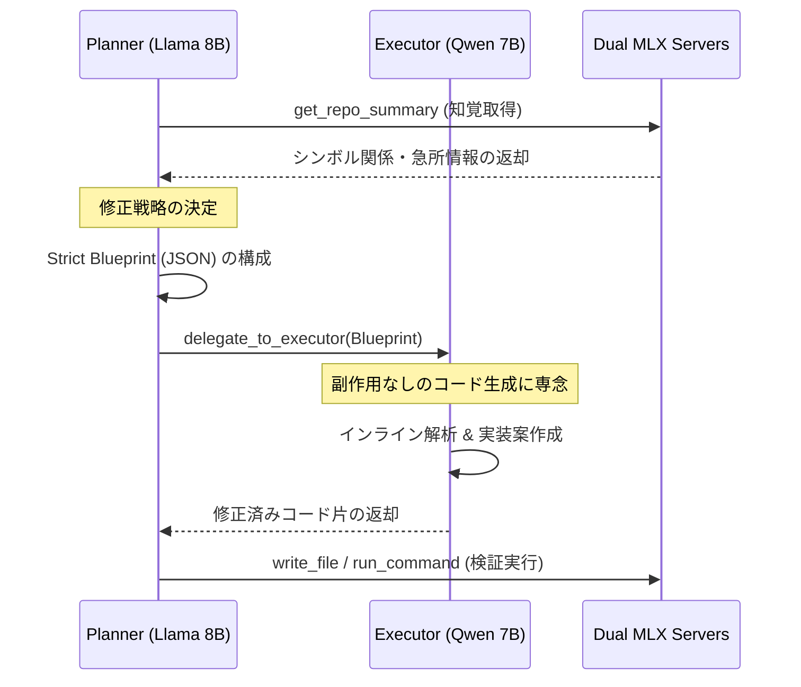
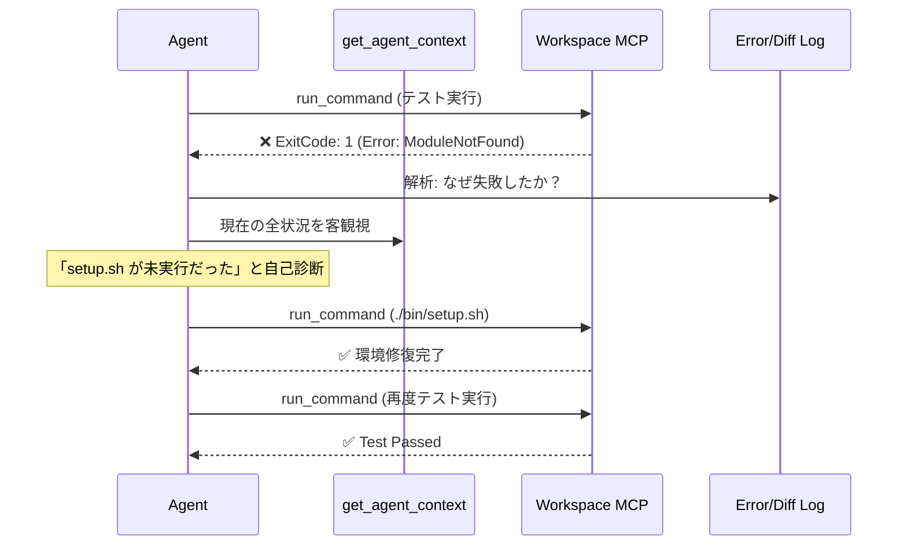
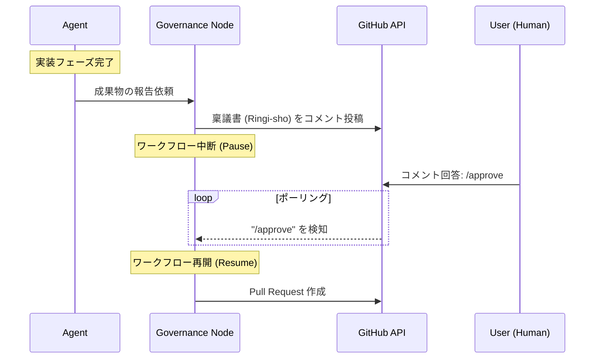

# Brownie システム全体全体図 (Home)

BROWNIE は、Model Context Protocol (MCP) を基盤とし、推論・知覚・実行を完全に分離した **「Agent-Friendly Architecture」** を採用する自律型 AI 開発環境です。

---

## 1. 3つのプレーン (The 3-Plane Design)

BROWNIE は、権限と責務を物理的・プロトコルレベルで分離することで、安全性と自律性を両立させています。

### 🧠 Control Plane (制御層)
- **Orchestrator**: 全体のライフサイクル管理、GitHub 監視。
- **Agent (Planner)**: Pydantic AI による意思決定。動的なツールディスパッチ。
- **Workflow (LangGraph)**: 状態の永続化とチェックポイント管理。

### 💾 Perception Plane (知覚層)
- **Knowledge MCP Server**: 
    - **WDCA (Wide-area Deep Context Awareness)**: DuckDB による AST 解析と NetworkX による依存関係グラフ。
    - **Memory**: ChromaDB による RAG。過去の修正パターンの検索。

### 🛠 Execution Plane (実行層)
- **Workspace MCP Server**: ファイル操作、Linter/Formatter の実行。
- **Sandbox (Docker)**: 破壊的コード実行と検証のための完全隔離環境。

---

## 2. 主要シーケンス (Core Sequences)

BROWNIE の強みを支える 3 つの主要な協調フローです。

### 2.1. Planner-Executor 連携フロー
司令塔 (Planner) と職人 (Executor) を分担させることで、ハルシネーションを抑制しつつ高精度な実装を実現します。

### 2.2. 自己診断・自己修復ループ (Self-Healing)
実行中のエラーや環境の不整合を自律的に検知し、自ら修正してタスクを完結させます。

### 2.3. ヒューマンインザループ (HITL Flow)
重要な決定や PR 作成前に、人間のレビューを仰ぎ、合意形成を行う安全装置です。

---

## 3. アーキテクチャの原則 (Principles)

1.  **High Locality**: `WorkspaceContext` による境界の集約。
2.  **Explicit Tools**: 厳格な型定義と Docstring による「明示的な手」。
3.  **Robust Infrastructure**: 確実なプロセス管理とクリーンアップ。
4.  **Meta-Cognition**: 自己の状態を客観視可能な知覚。

詳細な各モジュールの設計書については、[README](../README.md) の Blueprint セクションを参照してください。
