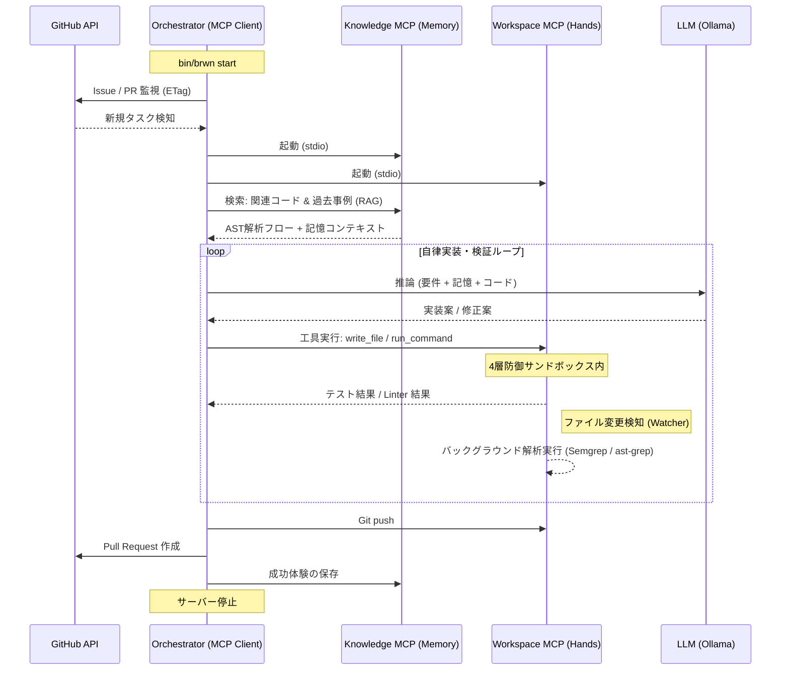

# 自律AIエージェント「BROWNIE」システム設計書

## 1. システム概要

BROWNIE は、GitHub をハブとした完全疎結合・MCP ベースの自律 AI ソフトウェアエンジニアリング環境である。人間と AI は GitHub Issue および PR 上で自然言語を用いて協働し、AI は要件定義から実装、テスト、PR作成、Wiki更新までの全ライフサイクルを自動で完結させる。

最新のアーキテクチャでは **Model Context Protocol (MCP)** を採用。推論、記憶、実行の 3 つのプレーンを分離し、標準プロトコル (stdio) で通信するマイクロサービス構成へと進化した。これにより、最小権限の原則 (Least Privilege) に基づく最高水準のセキュリティと、リポジトリ単位での高度な並列処理を実現している。

---

## 2. 動作環境と技術スタック

### 2.1. ハードウェア要件
- **Mac**: 32GB Unified Memory 以上推奨
- **Linux**: Ryzen AI / NVidia 推論環境 (RAM 64GB 以上推奨)
- **ストレージ**: 1TB 以上の高速 NVMe SSD (LLM モデル、Docker イメージ、Vector DB 用)

### 2.2. ソフトウェアスタック (MCP 構成)

| カテゴリ | ツール / サーバー | 役割 |
| :--- | :--- | :--- |
| **Control Plane** | Orchestrator & CoderAgent | 推論エンジン (Ollama / vLLM 互換) と連携した意思決定。 |
| **Perception Plane** | Knowledge MCP Server | ChromaDB (ベクトルDB) と DuckDB (AST解析) による記憶と知覚。 |
| **Execution Plane** | Workspace MCP Server | Docker 隔離サンドボックス内でのファイル操作・検証・実行。 |
| **主要ライブラリ** | fastmcp, PyGithub, tree-sitter | MCP プロトコル通信、GitHub 操作、コード構造解析。 |

---

## 3. システム・アーキテクチャ (The 3-Plane Design)

BROWNIE は、権限と責務を 3 つの層に分離し、相互の依存関係を最小化している。

### 3.1. アーキテクチャ・シーケンス (Mermaid)

### 3.2. コア・コンポーネント詳細

#### 🧠 THE BRAIN (Control Plane)
- **Orchestrator**: 全体のライフサイクル管理。監視、MCP サーバーの起動・終了、OAuth/PAT 認可。
- **CoderAgent (`agent.py`)**: 動的ツールレジストリを持つ MCP クライアント。どのツールがどの MCP サーバーにあるかを管理し、Hallucination を抑制しながらツールをディスパッチする。

#### 💾 THE MEMORY (Perception Plane)
- **Knowledge Server**:
  - **ベクトル検索**: ChromaDB を使用し、過去の成功事例やドキュメントを RAG (Retrieval-Augmented Generation) として提供。
  - **AST フロー解析**: DuckDB を背面エンジンとし、プロジェクト全体のシンボル依存関係、複雑な関数呼び出しフローを瞬時に Agent へ伝える。

#### 🛠 THE HANDS (Execution Plane)
- **Workspace Server**:
  - **4層防御システム**: Docker 隔離、DNS Proxy、YAML サニタイザ、User ID マッピングを完全に継承。
  - **ツール提供**: ファイル操作 (`read`/`write`)、コマンド実行 (`run`)、Linter/Formatter、セキュアスキャン、Semgrep 解析を MCP ツールとして公開。

---

## 4. サンドボックス & セキュリティ (The Least Privilege Principle)

BROWNIE のセキュリティ設計は、**「推論プロセスに権限を与えない」**ことに集約される。

1.  **認可 (Protocol-level Auth)**: 推論エンジン (Agent) は Workspace MCP Server が提供するインターフェース経由でしかファイルにアクセスできない。
2.  **隔離 (Containerization)**: すべての破壊的操作（コマンド実行、コード変更）は、ホストから論理的に切り離された Docker コンテナ内で完結する。
3.  **浄化 (Log Scrubbing)**: 出力ログから機密情報 (API Keys, Tokens) を自動検知し、エージェントに戻す前にマスク処理を行う。

---

## 5. 自己修復・運用シーケンス

- **自己修復メタ・ループ**: `SystemInternalError` 発生時、自分自身のリポジトリに Issue を起票し、解決するための PR を自ら発行する。
- **Resume (同期再開)**: 停止・クラッシュ後の再開時は、必ず `git pull --rebase` を実行し、クリーンな履歴を維持。
- **Wiki 同期**: 生成された `/docs` 内のドキュメントを `git subtree push` で Wiki リポジトリへ自動同期。

---

## 6. 詳細設計書 (Blueprints)

AIがシステムを深く理解し、コードを復元・拡張するための厳密な設計図です。

- [StateManager 設計書](https://github.com/globalpocket/brownie/wiki/src_core_state)
- [MCPServerManager 設計書](https://github.com/globalpocket/brownie/wiki/src_mcp_server_manager)
- [SandboxManager 設計書](https://github.com/globalpocket/brownie/wiki/src_workspace_sandbox)
- [Orchestrator 設計書](https://github.com/globalpocket/brownie/wiki/src_core_orchestrator)

---

BROWNIE は、「信頼できない AI 推論」を「信頼できるインフラ設計」で包むことにより、実戦レベルの自律エンジニアリングを実現している。
